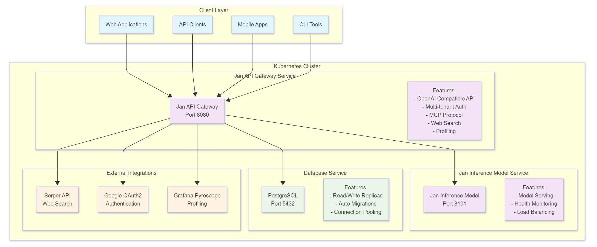

# Jan Server

A comprehensive self-hosted AI server platform that provides OpenAI-compatible APIs, multi-tenant organization management, and AI model inference capabilities. Jan Server enables organizations to deploy their own private AI infrastructure with full control over data, models, and access.

## 🚀 Overview

Jan Server is a Kubernetes-native platform consisting of multiple microservices that work together to provide a complete AI infrastructure solution. It offers:

- **OpenAI-Compatible API**: Full compatibility with OpenAI's chat completion API
- **Multi-Tenant Architecture**: Organization and project-based access control
- **AI Model Inference**: Scalable model serving with health monitoring
- **Database Management**: PostgreSQL with read/write replicas
- **Authentication & Authorization**: JWT + Google OAuth2 integration
- **API Key Management**: Secure API key generation and management
- **Model Context Protocol (MCP)**: Support for external tools and resources
- **Web Search Integration**: Serper API integration for web search capabilities
- **Monitoring & Profiling**: Built-in performance monitoring and health checks

## 🏗️ System Architecture




## 📦 Services

### Jan API Gateway
The core API service that provides OpenAI-compatible endpoints and manages all client interactions.

**Key Features:**
- OpenAI-compatible chat completion API with streaming support
- Multi-tenant organization and project management
- JWT-based authentication with Google OAuth2 integration
- API key management at organization and project levels
- Model Context Protocol (MCP) support for external tools
- Web search integration via Serper API
- Comprehensive monitoring and profiling capabilities
- Database transaction management with automatic rollback

**Technology Stack:**
- Go 1.24.6 with Gin web framework
- PostgreSQL with GORM and read/write replicas
- JWT authentication and Google OAuth2
- Swagger/OpenAPI documentation
- Built-in pprof profiling with Grafana Pyroscope integration

### Jan Inference Model
The AI model serving service that handles model inference requests.

**Key Features:**
- Scalable model serving infrastructure
- Health monitoring and automatic failover
- Load balancing across multiple model instances
- Integration with various AI model backends

**Technology Stack:**
- Python-based model serving
- Docker containerization
- Kubernetes-native deployment

### PostgreSQL Database
The persistent data storage layer with enterprise-grade features.

**Key Features:**
- Read/write replica support for high availability
- Automatic schema migrations with Atlas
- Connection pooling and optimization
- Transaction management with rollback support

## 🚀 Quick Start

### Prerequisites
- **Docker**: For containerization
- **Minikube**: For local Kubernetes development
- **Helm**: For package management and deployment
- **kubectl**: For Kubernetes cluster management

### Local Development Setup

1. **Start Minikube and configure Docker**:
   ```bash
   minikube start
   eval $(minikube docker-env)
   alias kubectl="minikube kubectl --"
   ```

2. **Build and deploy all services**:
   ```bash
   ./scripts/run.sh
   ```

3. **Access the services**:
   - **API Gateway**: http://localhost:8080
   - **Swagger UI**: http://localhost:8080/api/swagger/index.html
   - **Health Check**: http://localhost:8080/healthcheck
   - **Version Info**: http://localhost:8080/v1/version

### Production Deployment

For production deployments, modify the Helm values in `charts/umbrella-chart/values.yaml` and deploy using:

```bash
helm install jan-server ./charts/umbrella-chart
```

## ⚙️ Configuration

### Environment Variables

The system is configured through environment variables defined in the Helm values file. Key configuration areas include:

#### Jan API Gateway Configuration
- **Database Connection**: PostgreSQL connection strings for read/write replicas
- **Authentication**: JWT secrets and Google OAuth2 credentials
- **API Keys**: Encryption secrets for API key management
- **External Services**: Serper API key for web search functionality
- **Model Integration**: Jan Inference Model service URL

#### Security Configuration
- **JWT_SECRET**: HMAC-SHA-256 secret for JWT token signing
- **APIKEY_SECRET**: HMAC-SHA-256 secret for API key encryption
- **Database Credentials**: PostgreSQL username, password, and database name

#### External Service Integration
- **SERPER_API_KEY**: API key for web search functionality
- **Google OAuth2**: Client ID, secret, and redirect URL for authentication
- **Model Service**: URL for Jan Inference Model service communication

### Helm Configuration

The system uses Helm charts for deployment configuration:

- **Umbrella Chart**: Main deployment chart that orchestrates all services
- **Service Charts**: Individual charts for each service (API Gateway, Inference Model)
- **Values Files**: Configuration files for different environments

## 🔧 Development

### Project Structure
```
jan-server/
├── apps/                          # Application services
│   ├── jan-api-gateway/           # Main API gateway service
│   │   ├── application/           # Go application code
│   │   ├── docker/               # Docker configuration
│   │   └── README.md            # Service-specific documentation
│   └── jan-inference-model/       # AI model inference service
│       ├── application/           # Python application code
│       └── Dockerfile           # Container configuration
├── charts/                        # Helm charts
│   ├── apps-charts/              # Individual service charts
│   └── umbrella-chart/           # Main deployment chart
├── scripts/                      # Deployment and utility scripts
└── README.md                     # This file
```

### Building Services

```bash
# Build API Gateway
docker build -t jan-api-gateway:latest ./apps/jan-api-gateway

# Build Inference Model
docker build -t jan-inference-model:latest ./apps/jan-inference-model
```

### Database Migrations

The system uses Atlas for database migrations:

```bash
# Generate migration files
go run ./apps/jan-api-gateway/application/cmd/codegen/dbmigration

# Apply migrations
atlas migrate apply --url "your-database-url"
```

## 📊 Monitoring & Observability

### Health Monitoring
- **Health Check Endpoints**: Available on all services
- **Model Health Monitoring**: Automated health checks for inference models
- **Database Health**: Connection monitoring and replica status

### Performance Profiling
- **pprof Endpoints**: Available on port 6060 for performance analysis
- **Grafana Pyroscope**: Continuous profiling integration
- **Request Tracing**: Unique request IDs for end-to-end tracing

### Logging
- **Structured Logging**: JSON-formatted logs across all services
- **Request/Response Logging**: Complete request lifecycle tracking
- **Error Tracking**: Unique error codes for debugging

## 🔒 Security

### Authentication & Authorization
- **JWT Tokens**: Secure token-based authentication
- **Google OAuth2**: Social authentication integration
- **API Key Management**: Scoped API keys for different access levels
- **Multi-tenant Security**: Organization and project-level access control

### Data Protection
- **Encrypted API Keys**: HMAC-SHA-256 encryption for sensitive data
- **Secure Database Connections**: SSL-enabled database connections
- **Environment Variable Security**: Secure handling of sensitive configuration

## 🚀 Deployment

### Local Development
```bash
# Start local cluster
minikube start
eval $(minikube docker-env)

# Deploy services
./scripts/run.sh

# Access services
kubectl port-forward svc/jan-server-jan-api-gateway 8080:8080
```

### Production Deployment
```bash
# Update Helm dependencies
helm dependency update ./charts/umbrella-chart

# Deploy to production
helm install jan-server ./charts/umbrella-chart

# Upgrade deployment
helm upgrade jan-server ./charts/umbrella-chart

# Uninstall
helm uninstall jan-server
```

## 📚 API Documentation

- **Swagger UI**: Available at `/api/swagger/index.html` when running
- **OpenAPI Specification**: Auto-generated from code annotations
- **Interactive Testing**: Built-in API testing interface


## 🤝 Contributing

1. Fork the repository
2. Create a feature branch
3. Make your changes
4. Add tests for new functionality
5. Submit a pull request